# Web Application Document - Projeto Individual - Módulo 2 - Inteli

## InteliRooms

### <a href="https://br.linkedin.com/in/sara-sbardelotto/pt">Sara Sbardelotto</a>

## Sumário

1. [Introdução](#c1)
2. [Visão Geral da Aplicação Web](#c2)
3. [Projeto Técnico da Aplicação Web](#c3)
4. [Desenvolvimento da Aplicação Web](#c4)

<br>

## <a name="c1"></a>1. Introdução

Atualmente, o sistema de reserva de salas do Inteli (Instituto de Tecnologia e Liderança) ocorre de modo presencial por meio da recepção. Entretanto, essa abordagem limita a autonomia dos alunos e gera frustrações, principalmente em períodos de alta demanda. <br>

O projeto InteliRooms visa desenvolver uma aplicação web que permita aos próprios usuários, especialmente alunos, consultarem a disponibilidade de salas e realizarem, editarem e cancelarem agendamentos, seguindo as regras institucionais preestabelecidas. <br>

Portanto, o foco do sistema é na experiência do usuário, para que eles tenham fácil acesso às principais funcionalidades de forma prática, como: visualização de horários e salas disponíveis, reserva com validação automática de acordo com as restrições e controle de agendamentos realizados. <br>

Assim, alunos como a Giulia Fachinelli, persona do projeto, terão sua demanda por um sistema de agendamentos mais prático, organizado e autônomo atendida, colaborando para sua gestão de tempo e organização pessoal para o uso de espaços compartilhados do Inteli.

---

## <a name="c2"></a>2. Visão Geral da Aplicação Web

### 2.1. Personas

A persona Giulia Fachinelli foi criada para representar os principais empecilhos enfretados pelos alunos do Inteli atrelados a reserva de salas de estudos da faculdade, permitindo um embasamento sólido para desenvolver o sistema InteliRooms de modo a atender as necessidades dos estudantes.

<div align="center">
<sub>Figura 1 - Persona</sub>
</div>

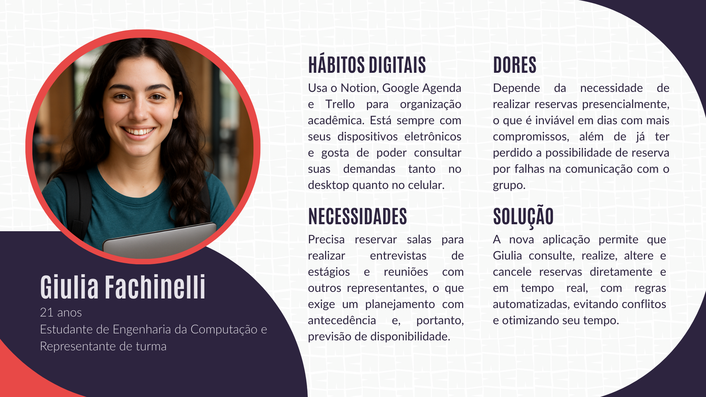

<div align="center">
</div>

<div align="center">
<sub>Fonte: Template disponível em Canva, adaptado por Sara Sbardelotto (2025)</sub>
</div>

### 2.2. User Stories

> US01 | Como estudante do Inteli, quero consultar os horários e as salas disponíveis para reserva, para que eu possa planejar meus agendamentos.

> US02 | Como estudante do Inteli, quero reservar uma sala por até 1 hora, respeitando as restrições da minha turma e grupo, para que minha reserva seja válida e sem conflitos.

> US03 | Como estudante do Inteli, quero cancelar ou alterar uma reserva feita, para que eu possa ajustar minha agenda e liberar a sala para outras pessoas.

Análise da US02 com base nos critérios **INVEST**:
- **I** – Independente: é possível implementar a consulta de horários/salas disponíveis separadamente das funcionalidades de reserva, alteração e cancelamento de reservas.
- **N** – Negociável: o formato do sistema (lista ou calendário) pode ser ajustado conforme as necessidades do projeto.
- **V** – Valiosa: garante a organização e autonomia para o planejamento do estudante.
- **E** – Estimável: o esforço para o desenvolvimento dessa funcionalidade pode ser estimado em relação ao backend, consulta ao banco de dados, frontend, exibição das informações, e integração, conexão entre ambos.
- **S** – Pequena (Small): está limitada a consultar apenas dados (salas e horários) predeterminados.
- **T** – Testável: permite testar se o sistema exibe corretamente as salas e os horários disponíveis.

---

## <a name="c3"></a>3. Projeto da Aplicação Web

### 3.1. Modelagem do banco de dados

### Modelo Relacional
O modelo relacional desenvolvido para o **InteliRooms** busca representar os alunos, as salas disponíveis e as reservas realizados. Cada entidade possui atributos que ajudam no controle de permissões.

<div align="center">
<sub>Figura 2 - Modelo Relacional </sub>
</div>

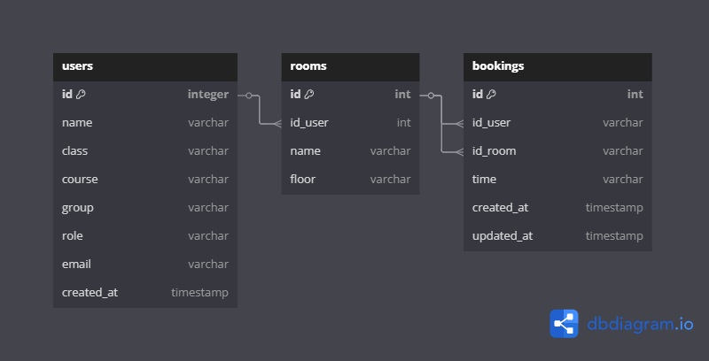

<div align="center">
</div>

<div align="center">
<sub>Fonte: Autoria própria, gerado pelo Supabase (2025)</sub>
</div>
<br>

* **Usuários** (users): representa os alunos do Inteli, principais usuários do sistema.

* **Salas** (rooms): representas as salas disponíveis para reserva de acordo com as regras institucionais.

* **Reservas** (bookings): representa as reservas realizadas pelo usuário.

### Modelo Físico
A seguir, é possível visualizar a estrutura das tabelas e suas relações em SQL:

```sql
CREATE TABLE IF NOT EXISTS "users" (
  "id" int PRIMARY KEY,
  "name" varchar,
  "class" varchar,
  "course" varchar,
  "group" varchar,
  "role" varchar,
  "email" varchar,
  "created_at" timestamp
);

CREATE TABLE IF NOT EXISTS "rooms" (
  "id" int PRIMARY KEY,
  "id_user" int,
  "name" varchar,
  "floor" varchar
);

CREATE TABLE IF NOT EXISTS "bookings" (
  "id" int PRIMARY KEY,
  "id_room" int,
  "id_user" int,
  "time" varchar,
  "created_at" timestamp,
  "updated_at" timestamp
);

ALTER TABLE "rooms" ADD FOREIGN KEY ("id_user") REFERENCES "users" ("id");

ALTER TABLE "bookings" ADD FOREIGN KEY ("id_room") REFERENCES "rooms" ("id");

ALTER TABLE "bookings" ADD FOREIGN KEY ("id_user") REFERENCES "rooms" ("id");
```

### Relacionamentos e Cardinalidade
**Usuários <-> Salas**
* Cada sala pode ter uma reserva por usuário (FK: is_user), relação 1:N.

**Usuários  <-> Agendamentos**
* Cada agendamento pertence a um usuário, relação 1:N.


### 3.1.1 BD e Models
#### Banco de Dados
Para que o sistema funcione corretamente, é necessário configurar a conexão com o banco de dados PostgreSQL e com o Supabase (utilizado para autenticação). Esta seção apresenta os trechos de código responsáveis por essas conexões e orientações sobre como definir as variáveis de ambiente necessárias.

A **conexão** com o **banco de dados PostgreSQL** é realizada utilizando o pacote `pg`.

```js
const { Pool } = require('pg');
require('dotenv').config();

const isSSL = process.env.DB_SSL === 'true';

const pool = new Pool({
  user: process.env.DB_USER,
  host: process.env.DB_HOST,
  database: process.env.DB_DATABASE,
  password: process.env.DB_PASSWORD,
  port: process.env.DB_PORT,
  ssl: isSSL ? { rejectUnauthorized: false } : false,
});

module.exports = {
  query: (text, params) => pool.query(text, params),
  connect: () => pool.connect(),
};
```

Crie um arquivo `.env` contendo as seguintes variáveis:
```js
DB_USER=
DB_HOST=
DB_DATABASE=
DB_PASSWORD=
DB_PORT=
DB_SSL=
PORT=
```

**Conexão com o Supabase**

O Supabase é utilizado para **autenticação de usuários**. Abaixo está o código para configurar a conexão com o serviço, também utilizando variáveis de ambiente:
```js
const { createClient } = require('@supabase/supabase-js');
require('dotenv').config();
const supabaseUrl = process.env.SUPABASE_URL;
const supabaseKey = process.env.SUPABASE_ANON_KEY;
if (!supabaseUrl || !supabaseKey) {
  throw new Error('Missing Supabase environment variables');
}
const supabase = createClient(supabaseUrl, supabaseKey);
module.exports = supabase;
```

Adicione as variáveis necessárias no arquivo `.env`:
```js
SUPABASE_URL=
SUPABASE_ANON_KEY=
```

#### Models
Esta seção descreve os **models** implementados no sistema web, responsáveis pela **comunicação com o banco de dados PostgreSQL**. Cada model representa uma entidade do sistema, com métodos que executam as operações básicas (CRUD).

---

#### `User` Model
Gerencia as informações dos usuários do sistema, como nome, e-mail e id.

#### Campos da Tabela `users`

| Campo | Tipo | Descrição |
|-------|------|-----------|
| `id` | UUID | Identificador único do usuário |
| `name` | TEXT | Nome completo do usuário |
| `email` | TEXT | E-mail do usuário |
| `created_at` | TIMESTAMP | Data de criação do usuário |

#### Métodos Disponíveis

| Método | Query SQL | Descrição |
|--------|-----------|-----------|
| `getAllUsers()` | `SELECT * FROM users` | Retorna todos os usuários |
| `getUserById(id)` | `SELECT * FROM users WHERE id = $1` | Retorna um usuário pelo ID |
| `createUser(data)` | `INSERT INTO users (name, email) VALUES ($1, $2) RETURNING *` | Cria um novo usuário |
| `update(id, data)` | `UPDATE users SET name = $1, email = $2 WHERE id = $3 RETURNING *` | Atualiza informações de um usuário |
| `delete(id)` | `DELETE FROM users WHERE id = $1 RETURNING *` | Remove um usuário do sistema |

---

#### `Room` Model
Gerencia o cadastro de salas disponíveis para reserva.

#### Campos da Tabela `rooms`

| Campo | Tipo | Descrição |
|-------|------|-----------|
| `id` | UUID | Identificador único da sala |
| `code` | TEXT | Código da sala (ex: R07) |
| `floor` | TEXT | Andar onde a sala está localizada |

#### Métodos Disponíveis

| Método | Query SQL | Descrição |
|--------|-----------|-----------|
| `getAll()` | `SELECT * FROM rooms` | Lista todas as salas |
| `getById(id)` | `SELECT * FROM rooms WHERE id = $1` | Retorna uma sala pelo ID |
| `getByCode(code)` | `SELECT * FROM rooms WHERE code = $1` | Retorna uma sala pelo código |
| `create(data)` | `INSERT INTO rooms (code, floor) VALUES ($1, $2) RETURNING *` | Cria uma nova sala |
| `update(id, data)` | `UPDATE rooms SET code = $1, floor = $2 WHERE id = $3 RETURNING *` | Atualiza os dados da sala |
| `delete(id)` | `DELETE FROM rooms WHERE id = $1 RETURNING *` | Remove uma sala do sistema |

---

#### `Booking` Model
Controla as reservas feitas por usuários para uma determinada sala e horário.

#### Campos da Tabela `bookings`

| Campo | Tipo | Descrição |
|-------|------|-----------|
| `id` | UUID | Identificador único da reserva |
| `user_id` | UUID | ID do usuário que realizou a reserva |
| `room_id` | UUID | ID da sala reservada |
| `time_slot` | TEXT | Horário da reserva (formato HH:mm) |
| `created_at` | TIMESTAMP | Data de criação da reserva |
| `updated_at` | TIMESTAMP | Data da última atualização |

#### Métodos Disponíveis

| Método | Query SQL | Descrição |
|--------|-----------|-----------|
| `getAll()` | `SELECT * FROM bookings` | Lista todas as reservas |
| `getById(id)` | `SELECT * FROM bookings WHERE id = $1` | Retorna uma reserva pelo ID |
| `getByUserRoomTime(userId, roomId, timeSlot)` | `SELECT * FROM bookings WHERE user_id = $1 AND room_id = $2 AND time_slot = $3` | Busca reserva específica |
| `getBookingsByUser(userId)` | `SELECT * FROM bookings WHERE user_id = $1` | Lista reservas de um usuário |
| `create(data)` | `INSERT INTO bookings (user_id, room_id, time_slot) VALUES ($1, $2, $3) RETURNING *` | Cria uma nova reserva |
| `update(id, data)` | `UPDATE bookings SET time_slot = $1, updated_at = CURRENT_TIMESTAMP WHERE id = $2 RETURNING *` | Atualiza uma reserva existente |
| `delete(id)` | `DELETE FROM bookings WHERE id = $1 RETURNING *` | Remove uma reserva do sistema |

---

- Os models implementados executam diretamente queries SQL com parâmetros.
- A conexão com o banco de dados é gerenciada pelo módulo `db` (`db.query(...)`).
- O uso de `RETURNING *` permite que o sistema obtenha o objeto recém-criado ou atualizado diretamente do banco de dados.

### 3.2. Arquitetura
O diagrama a seguir representa a arquitetura da aplicação **InteliRooms**, estruturada segundo o padrão **MVC** (Model-View-Controller). Este padrão foi escolhido para garantir organização, escalabilidade e separação de responsabilidades entre as diferentes camadas da aplicação.

<div align="center">

<sub> Figura 3 - Diagrama Arquitetura MVC </sub>
</div>


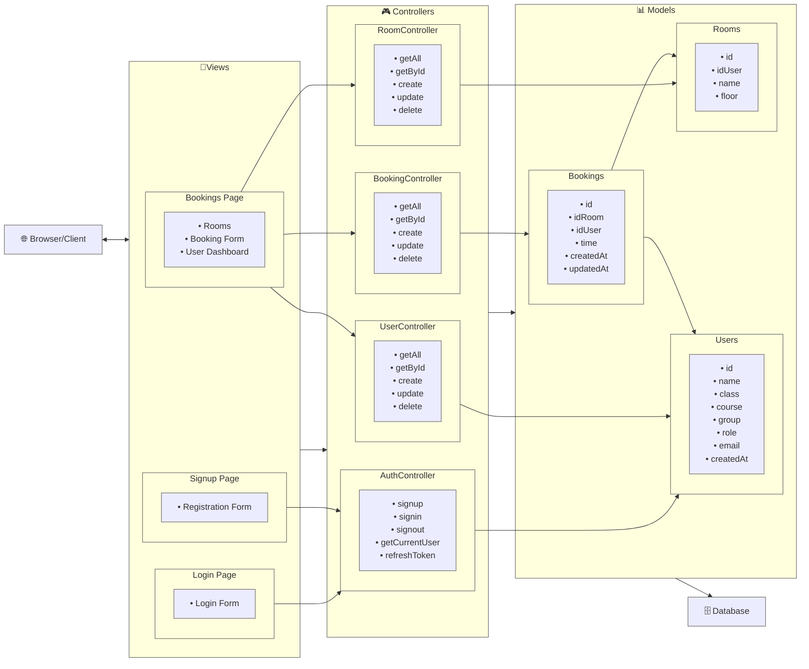

<div align="center">
<sub> Fonte: Autoria própria, criado com Mermaid (2025) </sub>
</div>
<br>

- A **View** é responsável pela interface com o usuário, incluindo páginas como login, cadastro e visualização de reservas. Ela se comunica diretamente com os controllers ao receber ações do usuário.
- Os **Controllers** atuam como intermediários entre a View e os Models. Cada controller (como `AuthController`, `UserController`, `RoomController` e `BookingController`) é responsável por processar requisições específicas, a lógica de negócio e retornar as respostas adequadas.
- A camada de **Models** contém a lógica de negócio e os esquemas de dados que representam as entidades do sistema: usuários, salas e reservas. Essa camada interage diretamente com o banco de dados.
- Por fim, o **cliente** interage com a interface web, disparando ações que percorrem esse fluxo de comunicação entre camadas, até atingir o banco de dados e retornar a resposta apropriada.

### 3.3. Wireframes

A seguir, são apresentados os wireframes das principais funcionalidades, que se relacionam diretamente às User Stories (US).

#### Navegabilidade
Para atender os requisitos do projeto enquanto solução para a persona que representa os alunos do Inteli, foi desenvolvida a sequência de wireframes abaixo:

<div align="center">

<sub>Figura 4 - Wireframe Navegação entre Telas </sub>
</div>

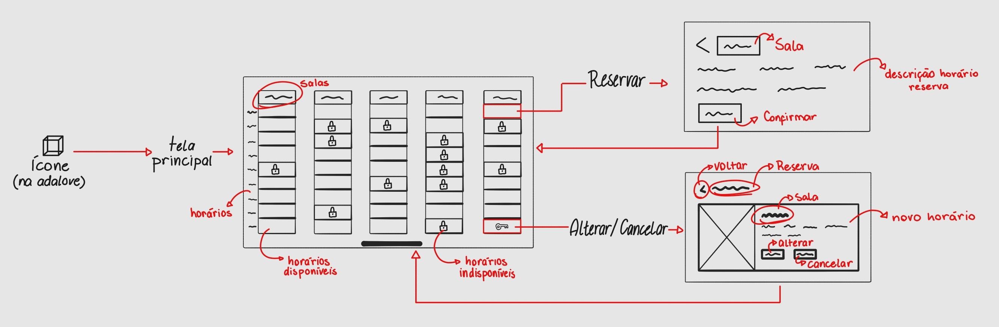

<div align="center">
</div>

<div align="center">
<sub>Fonte: Autoria própria (2025)</sub>
</div>
<br>

Nesse wireframe, a tela principal será acessada na Adalove, plataforma utilizada pelos estudantes do Inteli, por meio de um widget no header, permitindo que os alunos selecionem um horário disponível da sala que desejam reservar. Assim, serão direcionados à uma tela de confirmação, que quando realizada a reserva, os redirecionam à tela principal de visualizaçao da disponibilidade de salas. Além disso, também é permitido que o usuário altere ou cancele um agendamento feito na tela principal.

#### Tela Principal
A tela principal se relaciona diretamente com a **US01**, pois mostra as salas disponíveis para reserva, colaborando com o planejamento do(a) estudante. Nela, é possível visualizar as salas, que se encontram nas colunas, bem como os horários disponíveis nas linhas para reserva. 

<div align="center">

<sub>Figura 5 - Wireframe Tela Principal </sub>
</div>

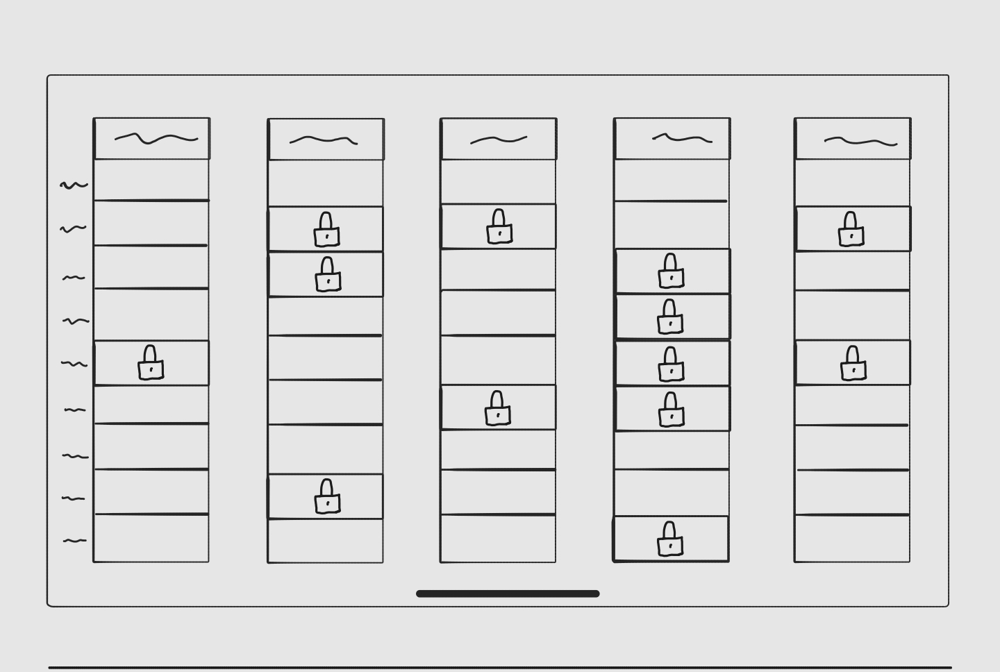

<div align="center">
</div>

<div align="center">
<sub>Fonte: Autoria própria (2025)</sub>
</div>
<br>

Cada item dessa "matriz" é clicável e direciona o usuário para as telas que serão detalhadas a seguir. É similar ao Google Calendar, no qual as colunas representam os dias da semana, mas, neste caso, isso não se aplica, visto que as salas só podem ser reservadas para o dia em questão.

#### Tela de Reserva
A partir da tela principal, é possível selecionar um horário disponível na sala desejada, o que direciona o/a estudante para a tela de reserva, representada pelo wireframe do modal abaixo, permitindo que uma reserva seja feita sem conflitos, de acordo com a **US02**.

<div align="center">

<sub>Figura 6 - Wireframe Tela de Reserva </sub>
</div>

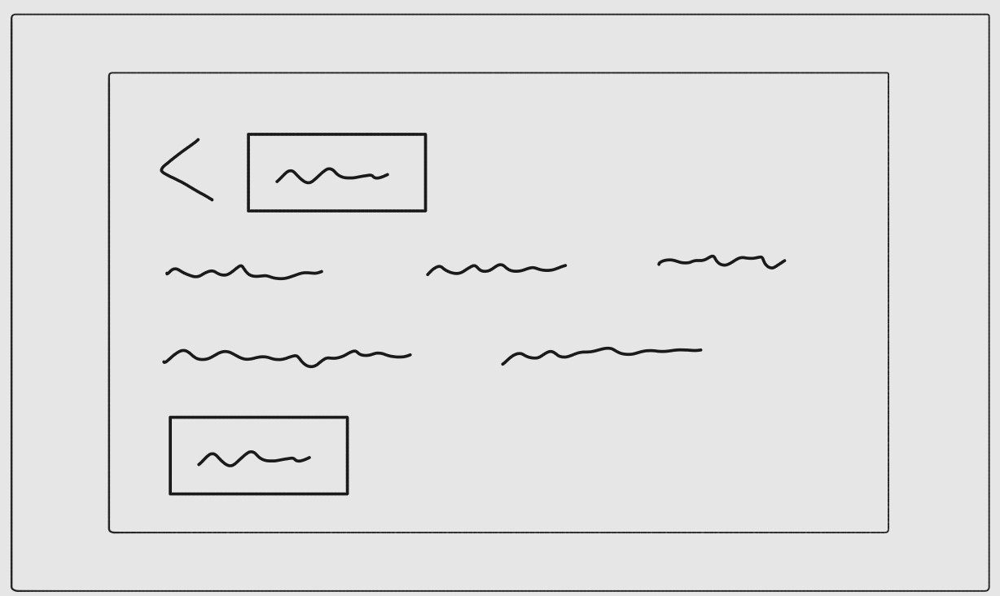

<div align="center">
</div>

<div align="center">
<sub>Fonte: Autoria própria (2025)</sub>
</div>
<br>

#### Tela de Cancelamento/Alteração
Por fim, também na tela principal, ao clicar na reserva realizada, o(a) estudante é direcionado(a) para um modal de cancelamento/alteração, apresentado no wireframe a seguir, que atende à necessidade da **US03**.

<div align="center">

<sub>Figura 7 - Wireframe Tela de Cancelamento/Alteração </sub>
</div>

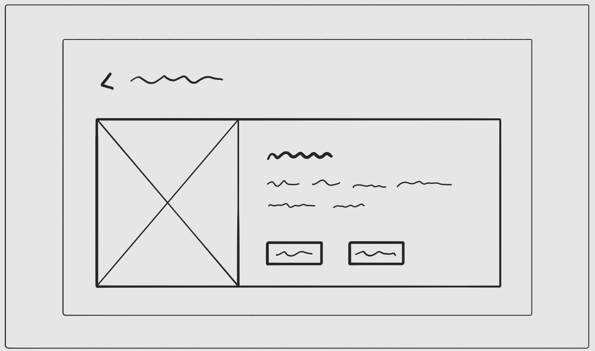

<div align="center">
</div>

<div align="center">
<sub>Fonte: Autoria própria (2025)</sub>
</div>
<br>

[Link complementar wireframe](https://drive.google.com/file/d/1gbPN1vG688K-E2yLvHXdORcSTWxpqRHO/view?usp=sharing)

### 3.4. Guia de estilos

O mini guia de estilos estabelece os padrões visuais da aplicação InteliRooms, desenvolvidos com base na identidade visual da Adalove. Como uma solução projetada visando uma futura integração à plataforma principal, o InteliRooms mantém coerência com o design system estabelecido, adaptando-o às necessidades específicas para reserva de salas.

O documento a seguir reúne os elementos fundamentais que garantem harmonia visual entre as aplicações, preservando a identidade da Adalove enquanto assegura que a identificação do usuário com o InteliRooms.

<div align="center">

<sub>Figura 8 - Mini Guia de Estilos </sub>
</div>

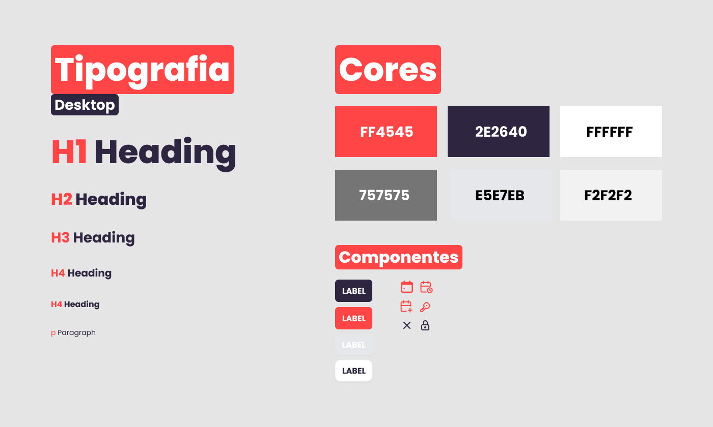

<div align="center">
</div>

<div align="center">
<sub>Fonte: Autoria própria (2025)</sub>
</div>
<br>

#### Orientações Gerais (uso do guia de estilos)
* **Consistência:** Todos os elementos devem seguir rigorosamente as especificações de cores, tipografia e componentes definidos neste guia para manter a coesão visual da plataforma.
* **Acessibilidade:** As combinações de cores foram testadas para garantir contraste adequado e legibilidade, atendendo aos padrões de acessibilidade web.
* **Hierarquia Visual:** Utiliza hierarquia tipográfica e cromática para guiar o usuário através da interface, destacando informações importantes e organizando o conteúdo de modo que textos de maior hierarquia com cores vibrantes se destaquem sobre aqueles de menor hierarquia com tons neutros.
  * Paleta de cores: marcada pelo contraste entre tons vibrantes e neutros, garantindo equilíbrio no destaque e na categorização de informações.
  * Tipografia: hierarquia tipográfica clara e moderna, garantindo legibilidade em diferentes contextos e dispositivos.
  * ícones: visual com traços vazados, que orientam o usuário a identificar facilmente as funcionalidades da aplicação.

Esse mini guia de estilos serve como referência fundamental para o desenvolvimento e manutenção da identidade visual do InteliRooms, garantindo uma experiência consistente e fluida para os usuários da plataforma.

Acesse aqui o [mini guia de estilos e layout da aplicação](https://www.figma.com/design/C2nASxGdM7WYo5goAXgZRp/Ponderada-3---Prot%C3%B3tipo-e-Guia-de-Estilos-Inteli-Rooms?node-id=72-9200&p=f&t=tCZpegu8CDgzw3oO-0).


### 3.5. Protótipo de alta fidelidade

O protótipo de alta fidelidade apresentado representa uma versão visual próxima a futura aplicação do InteliRooms, sistema de reservas de salas, integrando elementos de interface consistentes e uma experiência de usuário pensada a partir das necessidades específicas dos alunos, que foram mapeadas por meio da persona.

Apesar de desenvolvido com foco na futura integração com a plataforma Adalove para autenticação unificada, o protótipo contempla soluções intermediárias que garantem a funcionalidade completa do sistema enquanto respeita as restrições institucionais atuais. Dessa forma, o sistema poderá operar de forma independente até que a integração definitiva seja implementada, sem comprometer a experiência do usuário ou a aplicação das regras de negócio necessárias.

#### Tela de Login
A tela de login serve como ponto de entrada seguro para a aplicação. Embora o objetivo final seja a integração com a plataforma Adalove, esta tela o acesso dos usuários ao sistema de reservas, respeitando as restrições institucionais.

<div align="center">

<sub>Figura 14 - Tela de Login</sub>
</div>


<div align="center">
<sub>Fonte: Autoria própria (2025)</sub>
</div>

#### Tela de Cadastro
A página de cadastro inclui um formulário completo com campos para:
- Nome completo
- Turma (select com opções T1-T19)
- Grupo (select com opções G01-G06)
- Curso (select com cursos disponíveis)
- Email
- Senha

<div align="center">
<sub>Figura 15 - Tela de Cadastro</sub>
</div>

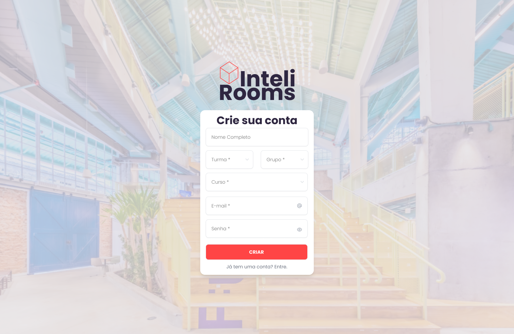

<div align="center">
<sub>Fonte: Autoria própria (2025)</sub>
</div>

##### Página Principal
A página principal implementa a grade de reservas, que é o componente central do sistema. A grade é construída dinamicamente usando EJS, com as seguintes características:

- Colunas representando as salas disponíveis
- Linhas representando os horários (das 7h às 20h)
- Células coloridas indicando disponibilidade:
  - Verde: Sala disponível
  - Vermelho: Sala reservada por outro usuário
  - Azul: Sala reservada pelo usuário atual

<div align="center">
<sub>Figura 16 - Tela Principal</sub>
</div>

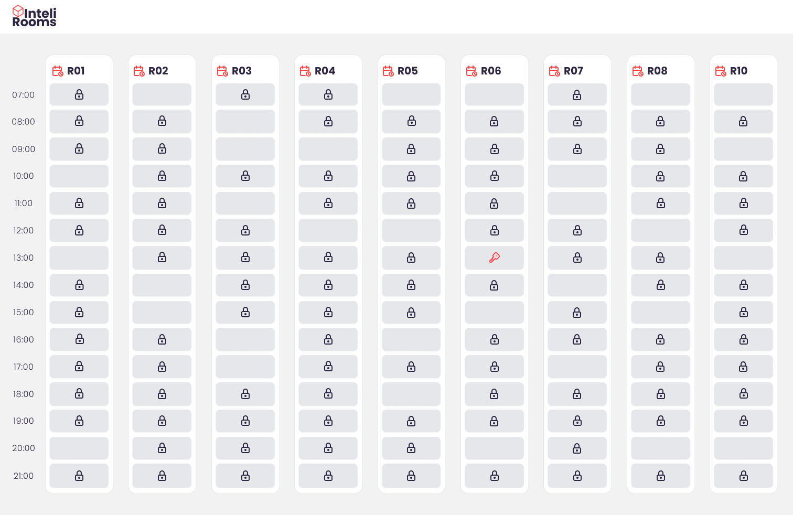

<div align="center">
<sub>Fonte: Autoria própria (2025)</sub>
</div>

##### Modais de Interação
O sistema utiliza modais para as interações de reserva e gerenciamento:

1. **Modal de Reserva**:
   - Exibe detalhes da sala e horário selecionados
   - Botão de confirmação para realizar a reserva
   - Validação em tempo real da disponibilidade

<div align="center">
<sub>Figura 17 - Modal de Confirmação de Reserva</sub>
</div>

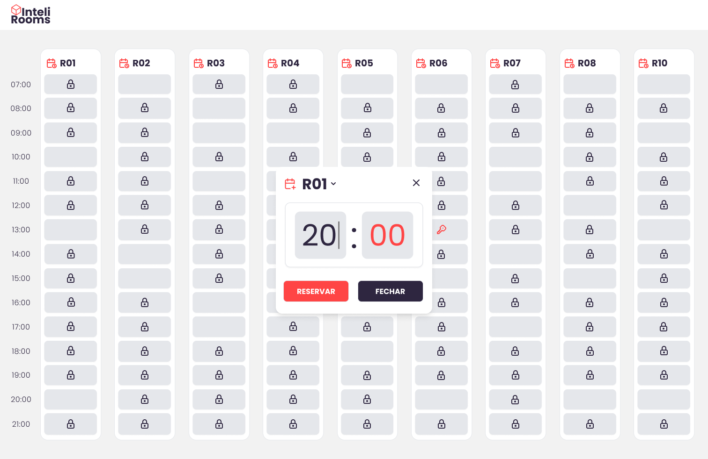

<div align="center">
<sub>Fonte: Autoria própria (2025)</sub>
</div>

2. **Modal de Cancelamento/Alteração**:
   - Exibe detalhes da reserva atual
   - Opções para alterar horário ou cancelar reserva
   - Confirmação antes de executar ações

<div align="center">
<sub>Figura 18 - Modal de Gerenciamento de Reserva</sub>
</div>

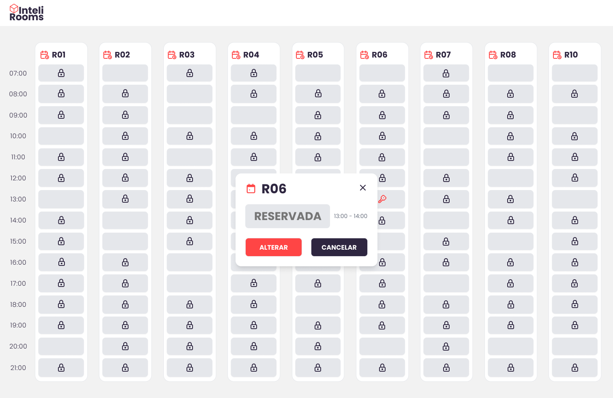

<div align="center">
<sub>Fonte: Autoria própria (2025)</sub>
</div>

### 3.6. WebAPI e endpoints

A API desenvolvida para o InteliRooms é organizada em rotas RESTful, separadas por usuários, salas, reservas, autenticação e frontend. Cada conjunto de rotas permite operações (Create, Read, Update, Delete) específicas para o recurso, com autenticação obrigatória na maioria dos casos.

As rotas seguem um padrão consistente de estrutura e resposta, utilizando parâmetros de caminho (path params) para identificar registros específicos e corpo da requisição (body) para envio de dados nos métodos POST e PUT. Todas as interações com o banco de dados são feitas por meio de queries SQL simples, garantindo clareza e eficiência.

Abaixo, estão listadas as rotas disponíveis, com suas respectivas finalidades, métodos HTTP, requisitos de autenticação e exemplos de uso.

#### **Rotas de Usuários**

| Método | Rota | Recurso | Autenticação | Descrição |
| :-- | :-- | :-- | :-- | :-- |
| GET | `/users` | Users | Sim | Lista todos os usuários |
| GET | `/users/:id` | Users | Sim | Busca usuário por ID |
| POST | `/users` | Users | Sim | Cria novo usuário |
| PUT | `/users/:id` | Users | Sim | Atualiza usuário existente |
| DELETE | `/users/:id` | Users | Sim | Remove usuário |

#### **GET /users**

- **Finalidade**: Recupera lista completa de todos os usuários cadastrados
- **Implementação**: Executa query `SELECT * FROM users` no banco
- **Parâmetros**: Nenhum
- **Resposta**: Array de objetos user

```json
[
  {
    "id": 1,
    "name": "Giulia Fachinelli",
    "class": "T16",
    "course": "Engenharia da Computação",
    "group": "G02",
    "role": "student",
    "email": "giulia.fachinelli@email.com",
    "created_at": "2025-01-01T10:00:00Z"
  }
]
```

#### **GET /users/:id**

- **Finalidade**: Busca usuário específico pelo ID
- **Implementação**: Query `SELECT * FROM users WHERE id = $1`
- **Parâmetros**:
    - `id` (path parameter): ID do usuário
- **Resposta**: Objeto user ou null se não encontrado


#### **POST /users**

- **Finalidade**: Cria novo usuário no sistema
- **Implementação**: INSERT na tabela users com campos id, name, email
- **Body**:

```json
{
  "id": 123,
  "name": "Davi Abreu",
  "email": "davi.abreu@email.com"
}
```

- **Resposta**: Objeto user criado com todos os campos


#### **PUT /users/:id**

- **Finalidade**: Atualiza dados de usuário existente
- **Implementação**: UPDATE na tabela users para name e email
- **Parâmetros**:
    - `id` (path parameter): ID do usuário
- **Body**:

```json
{
  "name": "Davi Abreu",
  "email": "davi.abreu@email.com"
}
```

- **Resposta**: Objeto user atualizado


#### **DELETE /users/:id**

- **Finalidade**: Remove usuário do sistema
- **Implementação**: DELETE da tabela users
- **Parâmetros**:
    - `id` (path parameter): ID do usuário
- **Resposta**: Boolean indicando sucesso da operação

---

#### **Rotas de Salas**

| Método | Rota | Recurso | Autenticação | Descrição |
| :-- | :-- | :-- | :-- | :-- |
| GET | `/rooms` | Rooms | Sim | Lista todas as salas |
| GET | `/rooms/:id` | Rooms | Sim | Busca sala por ID |
| GET | `/rooms/code/:code` | Rooms | Sim | Busca sala por código |
| POST | `/rooms` | Rooms | Sim | Cria nova sala |
| PUT | `/rooms/:id` | Rooms | Sim | Atualiza sala existente |
| DELETE | `/rooms/:id` | Rooms | Sim | Remove sala |

#### **GET /rooms**

- **Finalidade**: Lista todas as salas disponíveis
- **Implementação**: Query `SELECT * FROM rooms`
- **Resposta**: Array de objetos room

```json
[
  {
    "id": 1,
    "id_user": 123,
    "name": "R07",
    "floor": "Térreo"
  }
]
```


#### **GET /rooms/:id**

- **Finalidade**: Busca sala específica pelo ID
- **Implementação**: Query `SELECT * FROM rooms WHERE id = $1`
- **Parâmetros**:
    - `id` (path parameter): ID da sala


#### **GET /rooms/code/:code**

- **Finalidade**: Busca sala pelo código
- **Implementação**: Query `SELECT * FROM rooms WHERE code = $1`
- **Parâmetros**:
    - `code` (path parameter): Código da sala (ex: R07)
- **Resposta**: Objeto room ou null se não encontrado

#### **POST /rooms**

- **Finalidade**: Cadastra nova sala no sistema
- **Implementação**: INSERT na tabela rooms
- **Body**:

```json
{
  "id": 101,
  "id_user": 123,
  "name": "R10",
  "floor": "Térreo"
}
```

- **Resposta**: Objeto room criado


#### **PUT /rooms/:id**

- **Finalidade**: Atualiza informações de sala existente
- **Implementação**: UPDATE na tabela rooms
- **Parâmetros**:
    - `id` (path parameter): ID da sala
- **Body**: Campos a serem atualizados (id_user, name, floor)


#### **DELETE /rooms/:id**

- **Finalidade**: Remove sala do sistema
- **Implementação**: DELETE da tabela rooms
- **Parâmetros**:
    - `id` (path parameter): ID da sala
- **Resposta**: Objeto room removido

---

#### **Rotas de Reservas**

| Método | Rota | Recurso | Autenticação | Descrição |
| :-- | :-- | :-- | :-- | :-- |
| GET | `/bookings` | Bookings | Sim | Lista todas as reservas |
| GET | `/bookings/:id` | Bookings | Sim | Busca reserva por ID |
| GET | `/bookings/user/:userId/room/:roomCode/time/:timeSlot` | Bookings | Sim | Busca reserva específica por usuário, sala e horário |
| GET | `/bookings/user/:userId` | Bookings | Sim | Lista todas as reservas de um usuário |
| POST | `/bookings` | Bookings | Sim | Cria nova reserva |
| PUT | `/bookings/:id` | Bookings | Sim | Atualiza reserva existente |
| DELETE | `/bookings/:id` | Bookings | Sim | Remove reserva |

#### **GET /bookings/user/:userId/room/:roomCode/time/:timeSlot**

- **Finalidade**: Busca reserva específica por usuário, sala e horário
- **Implementação**: Query `SELECT * FROM bookings WHERE user_id = $1 AND room_id = $2 AND time_slot = $3`
- **Parâmetros**:
    - `userId` (path parameter): ID do usuário
    - `roomCode` (path parameter): Código da sala
    - `timeSlot` (path parameter): Horário da reserva
- **Resposta**: Objeto booking ou null se não encontrado

#### **GET /bookings/user/:userId**

- **Finalidade**: Lista todas as reservas de um usuário específico
- **Implementação**: Query `SELECT * FROM bookings WHERE user_id = $1`
- **Parâmetros**:
    - `userId` (path parameter): ID do usuário
- **Resposta**: Array de objetos booking

#### **POST /bookings**

- **Finalidade**: Cria nova reserva de sala
- **Implementação**: INSERT na tabela bookings
- **Body**:

```json
{
  "id": 201,
  "id_user": 123,
  "id_room": 101,
  "time": "2025-05-26 15:00"
}
```

- **Resposta**: Objeto booking criado


#### **PUT /bookings/:id**

- **Finalidade**: Atualiza reserva existente
- **Implementação**: UPDATE na tabela bookings, atualiza campo updated_at automaticamente
- **Parâmetros**:
    - `id` (path parameter): ID da reserva
- **Body**: Campos a serem atualizados (id_user, id_room, time)


#### **DELETE /bookings/:id**

- **Finalidade**: Cancela/remove reserva
- **Implementação**: DELETE da tabela bookings
- **Parâmetros**:
    - `id` (path parameter): ID da reserva
- **Resposta**: Objeto booking removido

---

#### Rotas de Autenticação

| Método | Rota | Recurso | Autenticação | Descrição |
| :-- | :-- | :-- | :-- | :-- |
| POST | `/auth/signin` | Auth | Não | Realiza login do usuário |
| POST | `/auth/signup` | Auth | Não | Registra novo usuário |
| POST | `/auth/signout` | Auth | Sim | Realiza logout do usuário |
| GET | `/auth/user` | Auth | Sim | Retorna dados do usuário atual |
| POST | `/auth/refresh` | Auth | Sim | Renova token de acesso |

#### **POST /auth/signin**

- **Finalidade**: Autentica usuário no sistema usando Supabase
- **Implementação**: Valida credenciais e gera token de acesso
- **Body**:

```json
{
  "email": "usuario@email.com",
  "password": "senha123"
}
```

- **Resposta**: 
```json
{
  "session": {
    "access_token": "eyJhbGciOiJIUzI1NiIsInR5cCI6IkpXVCJ9...",
    "refresh_token": "eyJhbGciOiJIUzI1NiIsInR5cCI6IkpXVCJ9..."
  },
  "user": {
    "id": "uuid",
    "email": "usuario@email.com",
    "name": "Nome do Usuário"
  }
}
```

#### **POST /auth/signup**

- **Finalidade**: Registra novo usuário no sistema usando Supabase
- **Implementação**: Cria nova conta de usuário e gera token de acesso
- **Body**:

```json
{
  "email": "usuario@email.com",
  "password": "senha123",
  "name": "Nome do Usuário"
}
```

- **Resposta**: Mesmo formato da resposta do signin

#### **POST /auth/signout**

- **Finalidade**: Realiza logout do usuário
- **Implementação**: Invalida token de acesso atual e limpa cookies
- **Resposta**: 
```json
{
  "message": "Signed out successfully"
}
```

#### **GET /auth/user**

- **Finalidade**: Retorna dados do usuário autenticado
- **Implementação**: Busca dados baseado no token de acesso
- **Resposta**: 
```json
{
  "id": "uuid",
  "email": "usuario@email.com",
  "name": "Nome do Usuário"
}
```

#### **POST /auth/refresh**

- **Finalidade**: Renova token de acesso expirado
- **Implementação**: Gera novo token baseado no refresh token
- **Body**: 
```json
{
  "refresh_token": "eyJhbGciOiJIUzI1NiIsInR5cCI6IkpXVCJ9..."
}
```
- **Resposta**: 
```json
{
  "access_token": "eyJhbGciOiJIUzI1NiIsInR5cCI6IkpXVCJ9...",
  "refresh_token": "eyJhbGciOiJIUzI1NiIsInR5cCI6IkpXVCJ9..."
}
```

#### **Segurança e Cookies**

O sistema utiliza cookies HTTP-only para armazenar o token de acesso, com as seguintes configurações:

```javascript
{
  httpOnly: true,
  secure: process.env.NODE_ENV === 'production',
  sameSite: 'strict',
  maxAge: 7 * 24 * 60 * 60 * 1000 // 7 dias
}
```

Isso garante que:
- O token não pode ser acessado por JavaScript no navegador
- O cookie só é enviado em conexões HTTPS em produção
- O cookie só é enviado em requisições do mesmo site
- O token expira após 7 dias

### 3.7 Interface e Navegação

O desenvolvimento do frontend do InteliRooms foi realizado utilizando EJS (Embedded JavaScript) como template engine, permitindo a criação de páginas dinâmicas com uma estrutura modular e reutilizável. A interface foi desenvolvida seguindo o guia de estilos estabelecido, garantindo consistência visual e uma experiência de usuário intuitiva.

#### Estrutura de Views

O sistema utiliza uma estrutura de views organizada em componentes reutilizáveis:

1. **Layout Base** (`views/layout/main.ejs`):
   - Template base que define a estrutura HTML comum a todas as páginas
   - Inclui configurações de meta tags, fontes e estilos globais
   - Gerencia a injeção de scripts e estilos específicos por página

2. **Componentes** (`views/components/`):
   - `header.ejs`: Cabeçalho com logo do sistema
   - `booking-grid.ejs`: Grade de horários e salas
   - `modal.ejs`: Modal reutilizável para ações de reserva
   - `time-slot-cell.ejs`: Célula individual da grade de horários

3. **Páginas Principais**:
   - `home.ejs`: Página principal com a grade de reservas
   - `signin.ejs`: Página de login
   - `signup.ejs`: Página de cadastro

#### Implementação da Interface

##### Página de Login
A página de login apresenta um formulário simples e intuitivo, com campos para email e senha. O design segue o guia de estilos, utilizando cores e tipografia consistentes com a identidade visual do sistema.

<div align="center">
<sub>Figura 14 - Tela de Login</sub>
</div>


<div align="center">
<sub>Fonte: Autoria própria (2025)</sub>
</div>

##### Página de Cadastro
A página de cadastro inclui um formulário completo com campos para:
- Nome completo
- Turma (select com opções T1-T19)
- Grupo (select com opções G01-G06)
- Curso (select com cursos disponíveis)
- Email
- Senha

<div align="center">
<sub>Figura 15 - Tela de Cadastro</sub>
</div>


<div align="center">
<sub>Fonte: Autoria própria (2025)</sub>
</div>

##### Página Principal
A página principal implementa a grade de reservas, que é o componente central do sistema. A grade é construída dinamicamente usando EJS, com as seguintes características:

- Colunas representando as salas disponíveis
- Linhas representando os horários (das 7h às 20h)
- Células coloridas indicando disponibilidade:
  - Verde: Sala disponível
  - Vermelho: Sala reservada por outro usuário
  - Azul: Sala reservada pelo usuário atual

<div align="center">
<sub>Figura 16 - Tela Principal</sub>
</div>


<div align="center">
<sub>Fonte: Autoria própria (2025)</sub>
</div>

##### Modais de Interação
O sistema utiliza modais para as interações de reserva e gerenciamento:

1. **Modal de Reserva**:
   - Exibe detalhes da sala e horário selecionados
   - Botão de confirmação para realizar a reserva
   - Validação em tempo real da disponibilidade

<div align="center">
<sub>Figura 17 - Modal de Confirmação de Reserva</sub>
</div>


<div align="center">
<sub>Fonte: Autoria própria (2025)</sub>
</div>

2. **Modal de Cancelamento/Alteração**:
   - Exibe detalhes da reserva atual
   - Opções para alterar horário ou cancelar reserva
   - Confirmação antes de executar ações

<div align="center">
<sub>Figura 18 - Modal de Gerenciamento de Reserva</sub>
</div>


<div align="center">
<sub>Fonte: Autoria própria (2025)</sub>
</div>

3. **Feedback de Sala Ocupada**:
   - Exibe mensagem quando uma sala já está reservada
   - Informa o usuário sobre a indisponibilidade
   - Sugere tentar outro horário

<div align="center">
<sub>Figura 19 - Feedback de Sala Ocupada</sub>
</div>


<div align="center">
<sub>Fonte: Autoria própria (2025)</sub>
</div>

#### Navegação e Interatividade

A navegação entre as páginas é intuitiva e direta:

1. **Fluxo de Autenticação**:
   - Usuário não autenticado é redirecionado para login
   - Após login bem-sucedido, redirecionamento para página principal
   - Opção de cadastro disponível na página de login

2. **Interação com a Grade**:
   - Clique em célula disponível abre modal de reserva
   - Clique em reserva própria abre modal de gerenciamento
   - Atualização em tempo real após ações de reserva/cancelamento

3. **Feedback Visual**:
   - Mensagens de sucesso/erro após ações
   - Indicadores visuais de estado das células
   - Animações suaves nas transições

#### Integração com Backend

A interface se comunica com o backend através de chamadas AJAX, implementadas nos scripts do lado do cliente:

- `scriptHome.js`: Gerencia interações na página principal
- `scriptSignIn.js`: Controla o processo de login
- `scriptSignUp.js`: Gerencia o cadastro de novos usuários

Cada script implementa:
- Validação de formulários
- Chamadas à API
- Atualização dinâmica da interface
- Tratamento de erros e feedback ao usuário

---

## <a name="c4"></a>4. Desenvolvimento da Aplicação Web

### 4.1 Demonstração do Sistema Web

**VIDEO:** (video)[]

O sistema InteliRooms foi desenvolvido como uma aplicação web completa utilizando a arquitetura MVC (Model-View-Controller) com Node.js, Express.js, PostgreSQL e Supabase para autenticação. Esta seção apresenta os principais componentes implementados e suas funcionalidades.

#### 4.1.1 Arquitetura e Estrutura do Sistema

O sistema foi estruturado seguindo as melhores práticas de desenvolvimento web, com separação clara de responsabilidades:

**Configuração e Infraestrutura:**
- **Servidor Principal** (`server.js`): Configuração do Express.js com middleware de sessão, CORS, EJS como template engine e conexão com banco de dados PostgreSQL
- **Configuração de Banco** (`config/db.js`): Pool de conexões PostgreSQL com suporte a SSL para produção
- **Configuração Supabase** (`config/supabase.js`): Cliente Supabase para autenticação de usuários

**Middleware de Autenticação:**
- `authMiddleware.js`: Verificação de tokens JWT do Supabase para rotas da API
- `authSessionMiddleware.js`: Middleware de sessão para rotas do frontend

#### 4.1.2 Camada de Modelos (Models)

Os modelos implementam as operações CRUD para cada entidade do sistema:

**UserModel** (`models/userModel.js`):
- `getAllUsers()`: Lista todos os usuários cadastrados
- `getUserById(id)`: Busca usuário específico por ID
- `createUser(data)`: Cria novo usuário no sistema
- `update(id, data)`: Atualiza informações do usuário
- `delete(id)`: Remove usuário do sistema

**RoomModel** (`models/roomModel.js`):
- `getAll()`: Lista todas as salas disponíveis
- `getById(id)`: Busca sala por ID
- `getByCode(code)`: Busca sala por código (ex: R07)
- `create(data)`: Cadastra nova sala
- `update(id, data)`: Atualiza informações da sala
- `delete(id)`: Remove sala do sistema

**BookingModel** (`models/bookingModel.js`):
- `getAll()`: Lista todas as reservas
- `getById(id)`: Busca reserva por ID
- `create(data)`: Cria nova reserva
- `update(id, data)`: Atualiza reserva existente
- `delete(id)`: Remove reserva
- `getByUserRoomTime(userId, roomId, timeSlot)`: Busca reserva específica
- `getBookingsByUser(userId)`: Lista reservas de um usuário

#### 4.1.3 Camada de Controladores (Controllers)

**AuthController** (`controllers/authController.js`):
- `signUp()`: Registro de novos usuários com criação automática de sessão
- `signIn()`: Autenticação de usuários existentes
- `signOut()`: Logout com limpeza de cookies e sessão
- `getCurrentUser()`: Retorna dados do usuário autenticado
- `refreshToken()`: Renovação de tokens de acesso

**HomeController** (`controllers/homeController.js`):
- `showHomePage()`: Renderiza página principal com grade de reservas
- `getBookingsForGrid()`: Busca reservas formatadas para exibição na grade

**BookingController** (`controllers/bookingController.js`):
- Implementa todas as operações CRUD para reservas
- Validação de propriedade de reservas (usuário só pode alterar suas próprias reservas)
- Integração com autenticação de sessão

**RoomController** e **UserController**:
- Implementam operações CRUD completas para suas respectivas entidades
- Tratamento de erros e validações apropriadas

#### 4.1.4 Camada de Serviços (Services)

**AuthService** (`services/authService.js`):
- Integração completa com Supabase Auth
- Gerenciamento de tokens e sessões
- Sincronização de dados de usuário entre Supabase e PostgreSQL

**UserService** (`services/userService.js`):
- Operações auxiliares para gerenciamento de usuários
- Validações e tratamento de erros específicos

#### 4.1.5 Sistema de Rotas

**Rotas de Autenticação** (`routes/authRoutes.js`):
```javascript
POST /auth/signin    - Login de usuário
POST /auth/signup    - Registro de usuário
POST /auth/signout   - Logout
GET  /auth/user      - Dados do usuário atual
POST /auth/refresh   - Renovação de token
```

**Rotas de Frontend** (`routes/frontRoutes.js`):
```javascript
GET /           - Página de login
GET /signup     - Página de cadastro
GET /signin     - Página de login
GET /home       - Página principal (autenticada)
```

**Rotas da API**:
- `/users/*`: Operações CRUD para usuários
- `/rooms/*`: Operações CRUD para salas
- `/bookings/*`: Operações CRUD para reservas

#### 4.1.6 Interface do Usuário

**Estrutura de Views:**
- **Layout Base** (`views/layout/main.ejs`): Template comum com configurações globais
- **Componentes Reutilizáveis**:
  - `header.ejs`: Cabeçalho com logo do sistema
  - `booking-grid.ejs`: Grade interativa de horários e salas
  - `modal.ejs`: Modal para ações de reserva/cancelamento
  - `time-slot-cell.ejs`: Célula individual da grade

**Páginas Principais:**
- `signin.ejs`: Formulário de login com validação
- `signup.ejs`: Formulário de cadastro com campos específicos (turma, grupo, curso)
- `home.ejs`: Página principal com grade de reservas interativa

**Scripts Frontend:**
- `scriptSignIn.js`: Gerencia processo de login com AJAX
- `scriptSignUp.js`: Controla cadastro de usuários
- `scriptHome.js`: Implementa interatividade da grade de reservas

#### 4.1.7 Banco de Dados

**Esquema Implementado** (`scripts/init.sql`):
```sql
-- Tabela de usuários com campos específicos do Inteli
CREATE TABLE users (
  id SERIAL PRIMARY KEY,
  name varchar,
  class varchar,      -- Turma (T1-T19)
  course varchar,     -- Curso
  "group" varchar,    -- Grupo (G01-G06)
  role varchar,
  email varchar,
  created_at timestamp DEFAULT CURRENT_TIMESTAMP
);

-- Tabela de salas com código único
CREATE TABLE rooms (
  id SERIAL PRIMARY KEY,
  code varchar NOT NULL UNIQUE,  -- Código da sala (R07, R08, etc.)
  name varchar,
  floor varchar,
  capacity int
);

-- Tabela de reservas com relacionamentos
CREATE TABLE bookings (
  id SERIAL PRIMARY KEY,
  room_id int REFERENCES rooms(id),
  user_id int REFERENCES users(id),
  time_slot varchar,  -- Horário da reserva
  created_at timestamp DEFAULT CURRENT_TIMESTAMP,
  updated_at timestamp DEFAULT CURRENT_TIMESTAMP
);
```

#### 4.1.8 Funcionalidades Implementadas

**Sistema de Autenticação:**
- Registro de usuários com dados específicos do Inteli (turma, grupo, curso)
- Login seguro com Supabase Auth
- Gerenciamento de sessões com cookies HTTP-only
- Middleware de proteção para rotas autenticadas

**Sistema de Reservas:**
- Grade visual interativa mostrando disponibilidade em tempo real
- Cores diferenciadas: verde (disponível), vermelho (ocupado), azul (reserva própria)
- Reserva com um clique em horários disponíveis
- Cancelamento e alteração de reservas próprias
- Validação de conflitos de horários

**Interface Responsiva:**
- Design baseado no guia de estilos da Adalove
- Modais para confirmação de ações
- Feedback visual para todas as operações
- Navegação intuitiva entre páginas

#### 4.1.9 Configuração e Deploy

**Variáveis de Ambiente:**
```
DB_USER, DB_HOST, DB_DATABASE, DB_PASSWORD, DB_PORT, DB_SSL
SUPABASE_URL, SUPABASE_ANON_KEY
SESSION_SECRET, NODE_ENV, PORT
```

**Scripts NPM:**
- `npm start`: Execução em produção
- `npm run dev`: Desenvolvimento com nodemon
- `npm test`: Execução de testes
- `npm run init-db`: Inicialização do banco de dados

### 4.2 Conclusões e Trabalhos Futuros

#### 4.2.1 Pontos Fortes do Sistema

**Arquitetura Sólida:**
O sistema foi desenvolvido seguindo o padrão MVC, garantindo separação clara de responsabilidades e facilitando manutenção e escalabilidade. A estrutura modular permite fácil extensão de funcionalidades.

**Segurança Robusta:**
- Integração com Supabase Auth para autenticação segura
- Cookies HTTP-only para proteção contra XSS
- Middleware de autenticação em todas as rotas protegidas
- Validação de propriedade de reservas (usuários só podem alterar suas próprias reservas)

**Interface Intuitiva:**
- Design consistente baseado no guia de estilos da Adalove
- Grade visual que facilita a compreensão da disponibilidade
- Feedback imediato para todas as ações do usuário
- Navegação simples e direta

**Funcionalidade Completa:**
- Sistema completo de CRUD para todas as entidades
- Reservas em tempo real com validação de conflitos
- Gerenciamento de usuários com dados específicos do Inteli
- API RESTful bem estruturada

**Qualidade de Código:**
- Testes unitários implementados
- Tratamento adequado de erros
- Código bem documentado e organizado
- Uso de boas práticas de desenvolvimento

#### 4.2.2 Pontos a Melhorar

**Performance e Otimização:**
- Implementar cache para consultas frequentes de disponibilidade
- Otimizar queries do banco de dados com índices apropriados
- Implementar paginação para listas grandes de reservas
- Adicionar compressão de assets estáticos

**Experiência do Usuário:**
- Implementar notificações push para lembretes de reservas
- Adicionar funcionalidade de reserva recorrente
- Melhorar responsividade para dispositivos móveis
- Implementar modo escuro/claro

**Funcionalidades Avançadas:**
- Sistema de aprovação para reservas de salas especiais
- Integração com calendário (Google Calendar, Outlook)
- Relatórios de uso das salas
- Sistema de avaliação das salas

**Monitoramento e Logs:**
- Implementar sistema de logs estruturados
- Adicionar monitoramento de performance
- Implementar alertas para falhas do sistema
- Dashboard administrativo para métricas

#### 4.2.3 Trabalhos Futuros

**Integração com Adalove:**
- Desenvolvimento de widget para integração na plataforma principal
- Single Sign-On (SSO) com sistema existente
- Sincronização de dados de usuários
- Padronização completa da interface

**Funcionalidades Avançadas:**
- **Sistema de Notificações**: Lembretes por email/SMS antes das reservas
- **Reservas Inteligentes**: Sugestão de horários baseada no histórico do usuário
- **Gestão de Recursos**: Controle de equipamentos disponíveis em cada sala
- **Analytics**: Dashboard com estatísticas de uso e relatórios gerenciais

**Melhorias Técnicas:**
- **Microserviços**: Separação em serviços independentes para maior escalabilidade
- **Cache Distribuído**: Implementação de Redis para melhor performance
- **API GraphQL**: Alternativa à API REST para consultas mais eficientes
- **Containerização**: Deploy com Docker para facilitar implantação

**Expansão do Sistema:**
- **Multi-campus**: Suporte a múltiplas unidades do Inteli
- **Tipos de Reserva**: Diferentes categorias (estudo, reunião, apresentação)
- **Integração IoT**: Sensores para verificação automática de ocupação
- **App Mobile**: Aplicativo nativo para iOS e Android

**Sustentabilidade e Manutenção:**
- **Documentação Técnica**: Guias completos para desenvolvedores
- **Testes Automatizados**: Cobertura completa com testes de integração
- **CI/CD**: Pipeline automatizado de deploy
- **Backup e Recuperação**: Estratégias robustas de backup de dados

O sistema InteliRooms representa uma solução completa e funcional para o problema de reserva de salas no Inteli, demonstrando a aplicação prática dos conceitos de desenvolvimento web full-stack. A base sólida implementada permite futuras expansões e melhorias, atendendo às necessidades crescentes da instituição e seus usuários.


