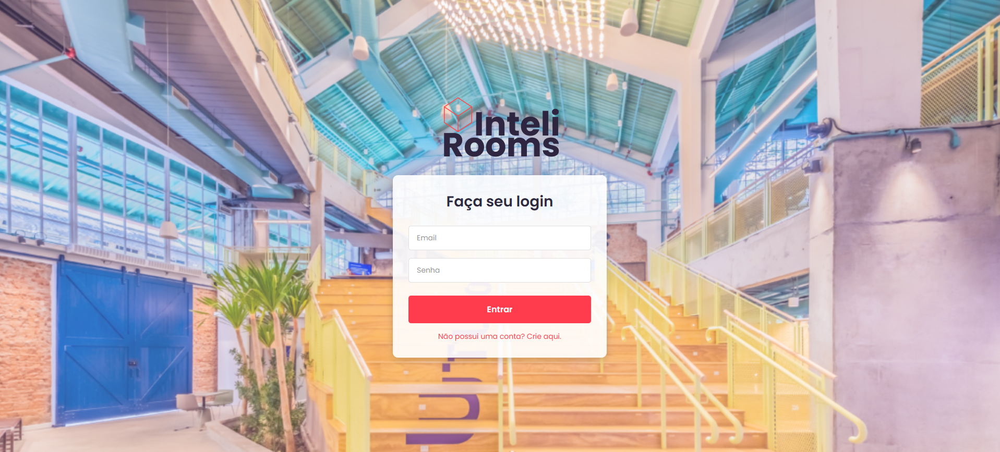
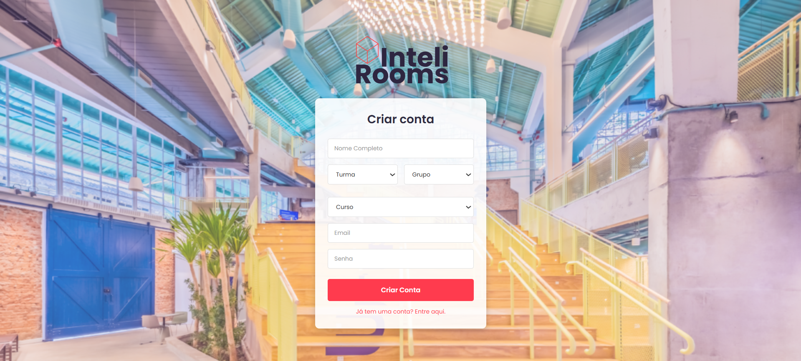
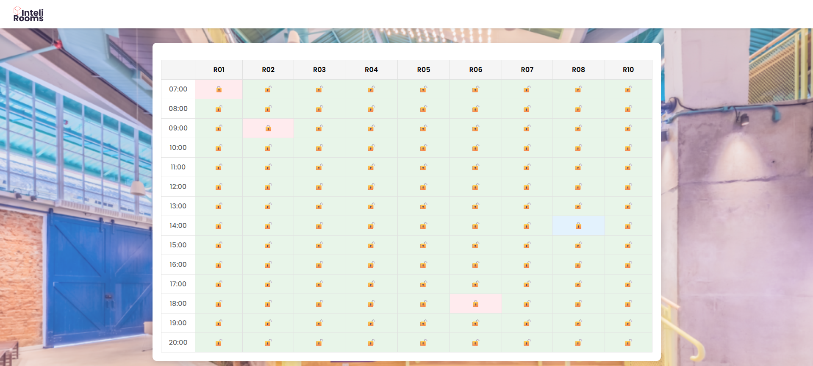
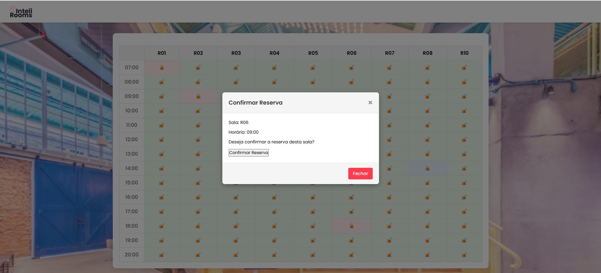
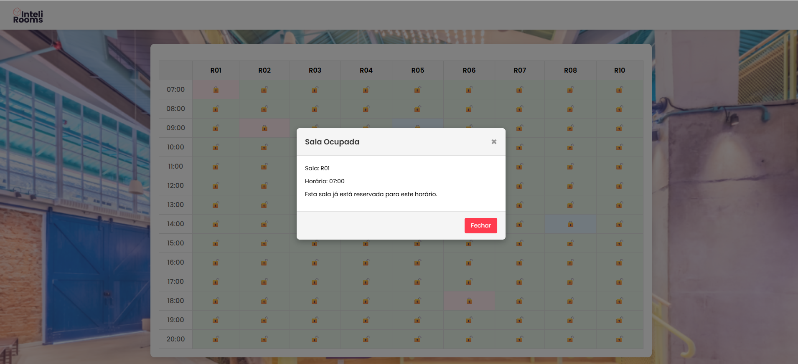

# InteliRooms | Projeto Individual M2

## Sobre o Projeto
O **InteliRooms** é um sistema web desenvolvido para otimizar a reserva de salas para os alunos do Inteli (Instituto de Tecnologia e Liderança). A plataforma permite que os alunos consultem a disponibilidade de salas em tempo real, realizem agendamentos de forma intuitiva e gerenciem suas reservas com facilidade.

## Funcionalidades
- **Autenticação de usuários** - Sistema de login e cadastro seguro

- **Visualização de disponibilidade** - Grade horária interativa das salas

- **Reserva de salas** - Reserva rápida e intuitiva

- **Gerenciamento de reservas** - Visualizar, editar e cancelar reservas

## Estrutura de Pastas (MVC)
```
projeto-individual/
│
├── config/                # Arquivos de configuração do banco
│   └── db.js
│   └── supabase.js
├── controllers/           # Lógica de controle das requisições
│   └── authController.js
│   └── bookingController.js
│   └── homeController.js
│   └── roomController.js
│   └── userController.js
├── middleware/            # Ferramenta mediadora
│   └── authMiddleware.js
│   └── authSessionMiddleware.js
├── models/                # Definição de modelos de dados (estrutura do banco)
│   └── bookingModel.js
│   └── roomModel.js
│   └── userModel.js
├── routes/                # Definição das rotas do sistema
│   └── index.js
├── services/              # Serviços auxiliares do sistema
│   └── userService.js
├── public/                # Arquivos públicos estáticos
│   ├── assets/           # Imagens e recursos visuais
│   │   ├── background.png
│   │   └── logoInteliRooms.png
│   └── scripts/          # Arquivos de JavaScript públicos
│       ├── scriptHome.js
│       ├── scriptSignIn.js
│       └── scriptSignUp.js
├── routes/               # Definição das rotas do sistema
│   ├── authRoutes.js
│   ├── bookingRoutes.js
│   ├── frontRoutes.js
│   ├── roomRoutes.js
│   └── userRoutes.js
├── scripts/              # Scripts do servidor
│   ├── init.sql
│   └── runSQLScript.js
├── services/             # Serviços auxiliares do sistema
│   ├── authService.js
│   └── userService.js
├── tests/                # Arquivos de testes unitários
├── views/                # Templates EJS
│   ├── components/       # Componentes reutilizáveis
│   │   ├── booking-grid.ejs
│   │   ├── header.ejs
│   │   ├── modal.ejs
│   │   └── time-slot-cell.ejs
│   ├── css/             # Arquivos CSS
│   │   └── style.css
│   ├── layout/          # Layouts base
│   ├── home.ejs         # Página inicial
│   ├── signin.ejs       # Página de login
│   └── signup.ejs       # Página de cadastro
├── .env                 # Arquivo de variáveis de ambiente
├── .env.example         # Exemplo de variáveis de ambiente
├── .gitignore          # Arquivo para ignorar arquivos no Git
├── jest.config.js      # Arquivo de configuração do Jest
├── package-lock.json   # Lock de dependências do Node.js
├── package.json        # Gerenciador de dependências do Node.js
├── readme.md           # Documentação do projeto (Markdown)
├── rest.http           # Teste de endpoints
└── server.js           # Arquivo principal que inicializa o servidor
```

---

## Como executar o projeto localmente

### Pré-requisitos
- [Node.js](https://nodejs.org/) (versão 14 ou superior)
- Banco de dados PostgreSQL ou Supabase
- Git instalado
- Um terminal compatível com comandos `npm`

### Passo a passo

#### 1. Utilize uma IDE (ex: VS Code)

#### 2. Clone o repositório:

```bash
   git clone https://github.com/sarafarencena/projeto-individual
   cd projeto-individual
```

#### 3. Instale as dependências:
No terminal (ctrl + j):

```bash
npm install
```

#### 4. Configure as variáveis de ambiente:

```
DB_HOST=
DB_DATABASE=
DB_PASSWORD=
DB_PORT=
DB_SSL=
PORT=

SUPABASE_URL=
SUPABASE_ANON_KEY=
SESSION_SECRET=
```

#### 5. Inicie o servidor:
```bash
npm run dev
```
ou
```bash
node server.js
```

#### 6. Acesse a aplicação
```arduino
http://localhost:3000
```

## Interface

### Tela de Login


### Tela de Cadastro


### Tela Principal (home)


### Tela Confirmação Reserva


### Tela de Gerenciamento


### Tela Sala Ocupada


## Demonstração
Assista ao [vídeo demonstrativo](https://drive.google.com/file/d/1M5Kg43FnrZs9MVSY7cuSOd2m1B_Gqezi/view?usp=sharing) completo, com todas as funcionalidades do sistema em funcionamento.

## Tecnologias Utilizadas
### Backend
- **Node.js** - Runtime JavaScript
- **Express.js** - Framework web
- **PostgreSQL** - Banco de dados relacional
- **Supabase** - Backend-as-a-Service

### Frontend
- **EJS** - Template engine

- **CSS** - Estilização e layout

- **JavaScript** - Interatividade do cliente

### Ferramentas
- **Jest** - Testes unitários

- **Git** - Controle de versão

- **npm** - Gerenciador de pacotes

## Licença
Esse projeto está sendo desenvolvido por [Sara Sbardelotto](https://br.linkedin.com/in/sara-sbardelotto/pt), aluna do 1° ano de Engenharia da Computação no Inteli.